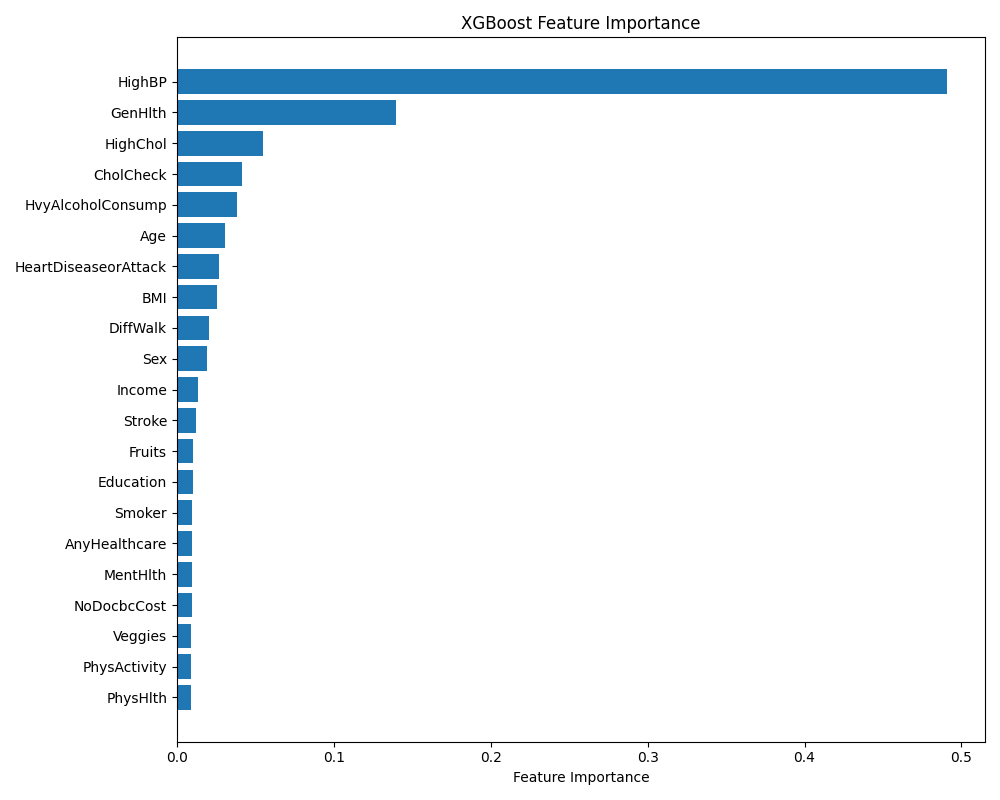
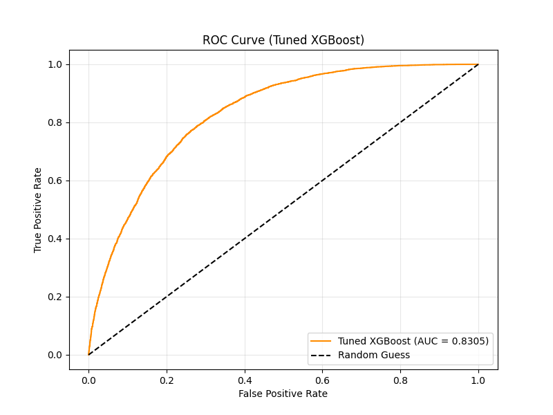

# Diabetes Classification Machine Learning Pipeline

This repository contains an end-to-end machine learning pipeline to predict diabetes risk based on medical and demographic features. The dataset used is derived from the BRFSS 2015 survey (`diabetes_binary_5050split_health_indicators_BRFSS2015.csv`).

## Project Structure

*   `train_models.py`: The original baseline training script that compares Logistic Regression, Random Forest, and XGBoost.
*   `train_optimized.py`: The final, optimized script. It performs Hyperparameter Tuning using `RandomizedSearchCV` with K-Fold Cross-Validation on the XGBoost model to find the best settings, and then exports the model.
*   `predict.py`: An inference script that loads the saved model (`best_xgboost_model.pkl`) and makes a prediction on a sample patient profile.
*   `app.py`: A sleek Streamlit web application that provides a user-friendly UI for making real-time predictions.
*   `combined_roc_curve.png`: ROC curve comparing model performance.
*   `feature_importance.png`: Feature importance chart showing which medical indicators drive the predictions.

## Setup Instructions

1.  **Clone the repository:**
    ```bash
    git clone https://github.com/anishkun/Logistic-Regression-to-classify-whether-a-patient-has-diabetes-based-on-medical-features.git
    cd Logistic-Regression-to-classify-whether-a-patient-has-diabetes-based-on-medical-features
    ```

2.  **Install Dependencies:**
    Ensure you have Python 3 installed, then run:
    ```bash
    pip install pandas scikit-learn matplotlib xgboost joblib
    ```

3.  **Run the Optimized Pipeline:**
    To tune the model, train it, and export the final `.pkl` file:
    ```bash
    python train_optimized.py
    ```

4.  **Run Inference (Terminal):**
    To test the exported model on a new (mock) patient profile from the command line:
    ```bash
    python predict.py
    ```

5.  **Run the Web Application:**
    To launch the interactive UI in your browser:
    ```bash
    streamlit run app.py
    ```

## Model Evaluation

Our tuned XGBoost model achieves an AUC of approximately **~0.83** on the hold-out test set, indicating strong discriminatory power between patients with and without diabetes.

### Feature Importance
The most critical factors determined by the model for predicting diabetes are typically High Blood Pressure, BMI, General Health, and Age.



### ROC Curves

