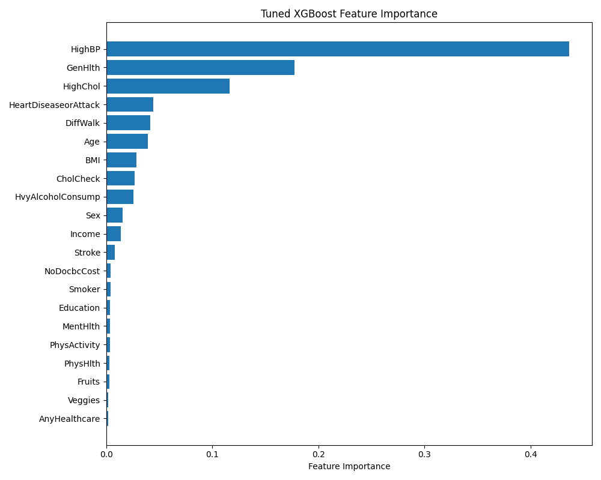
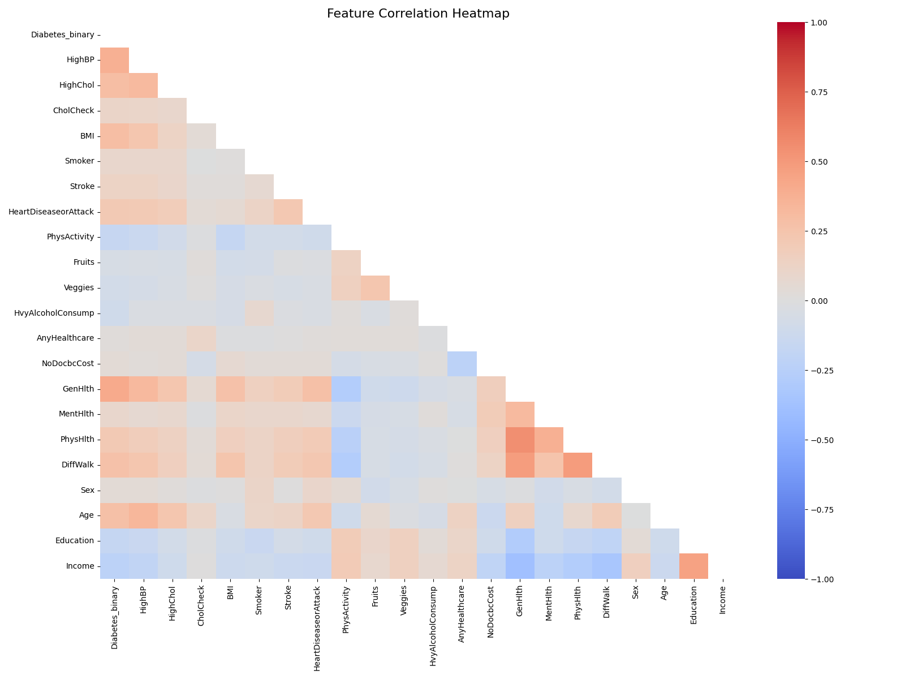
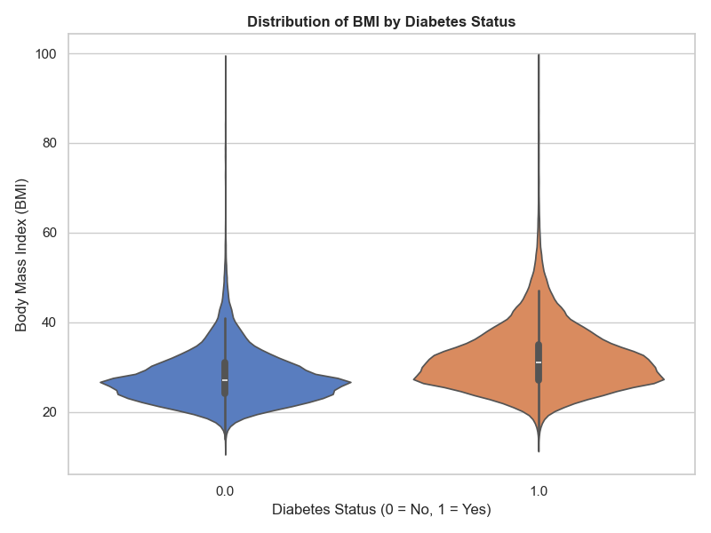
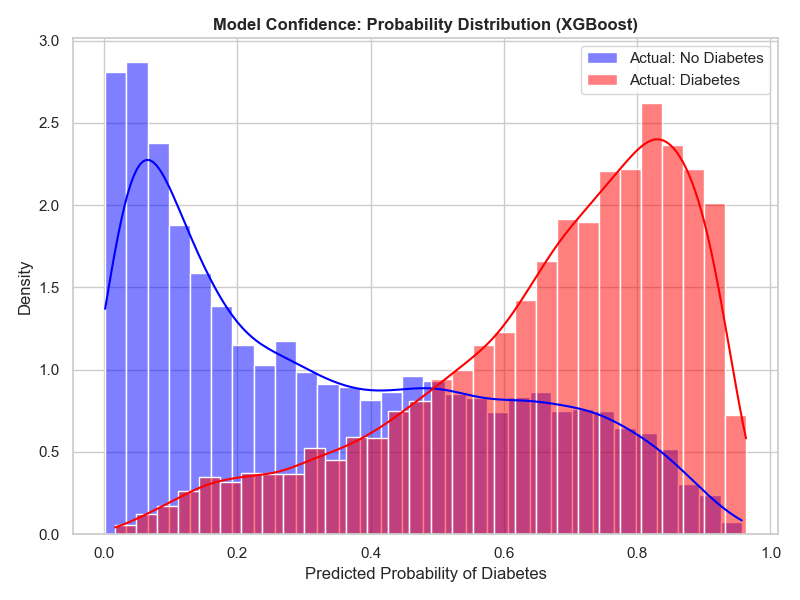
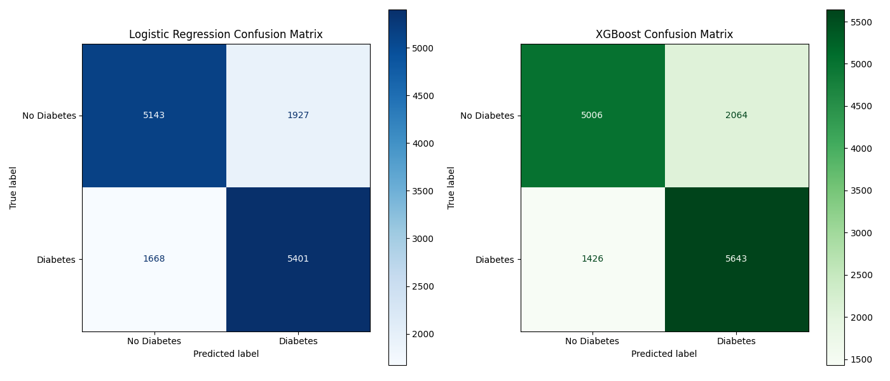
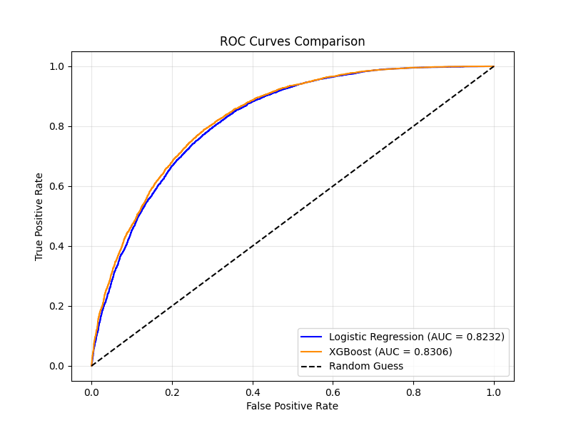

# Diabetes Classification Machine Learning Pipeline

This repository contains an end-to-end machine learning pipeline to predict diabetes risk based on medical and demographic features. The dataset used is derived from the BRFSS 2015 survey (`diabetes_binary_5050split_health_indicators_BRFSS2015.csv`).

## Project Structure

*   `scripts/train_models.py`: The original baseline training script that compares Logistic Regression, Random Forest, and XGBoost.
*   `scripts/train_optimized.py`: The final, optimized multi-model script. It performs Hyperparameter Tuning on both **Logistic Regression** and **XGBoost** and exports both models (along with the required data scaler).
*   `notebooks/Train_Multi_Model_Colab.ipynb`: A Jupyter Notebook ready to be uploaded and run on Google Colab for fast GPU/cloud training.
*   `predict.py`: An inference script that loads the saved models and makes a prediction on a sample patient profile. Supports model switching.
*   `app.py`: A sleek Streamlit web application that provides a user-friendly UI for making real-time predictions with an easy toggle between Logistic Regression and XGBoost.
*   `images/combined_roc_curve.png`: ROC curve comparing model performance.
*   `images/feature_importance.png`: Feature importance chart showing which medical indicators drive the predictions.
*   `images/correlation_heatmap.png`: A heatmap showing the correlation between all health indicators.
*   `images/confusion_matrices.png`: Confusion matrices evaluating the true/false positive rates for both models.
*   `images/class_distribution.png`: Bar chart showing the target variable distribution.
*   `images/bmi_distribution.png`: Violin plot comparing BMI across diabetes status.
*   `images/probability_distribution.png`: Histogram showing model confidence levels.
*   `scripts/generate_graphs.py`: Script to generate the extended visual representations.

## Setup Instructions

1.  **Clone the repository:**
    ```bash
    git clone https://github.com/anishkun/Logistic-Regression-to-classify-whether-a-patient-has-diabetes-based-on-medical-features.git
    cd Logistic-Regression-to-classify-whether-a-patient-has-diabetes-based-on-medical-features
    ```

2.  **Install Dependencies:**
    Ensure you have Python 3 installed, then run:
    ```bash
    pip install pandas scikit-learn matplotlib xgboost joblib
    ```

3.  **Run the Optimized Pipeline:**
    To tune the model, train it, and export the final `.pkl` files to the `models/` folder:
    ```bash
    python scripts/train_optimized.py
    ```

4.  **Run Inference (Terminal):**
    To test the exported model on a new (mock) patient profile from the command line (Logistic Regression is the default):
    ```bash
    python predict.py
    ```
    To use XGBoost instead:
    ```bash
    python predict.py --model xgboost
    ```

5.  **Run the Web Application:**
    To launch the interactive UI in your browser:
    ```bash
    streamlit run app.py
    ```

## Model Evaluation

This project perfectly fulfills the assignment requirement to use **Logistic Regression** for diabetes classification, while providing **XGBoost** as an optional high-performance alternative.

Our tuned Logistic Regression model achieves an AUC of **~0.82**, while the XGBoost model achieves an AUC of approximately **~0.83** on the hold-out test set, indicating strong discriminatory power between patients with and without diabetes.

### Feature Importance (XGBoost)
The most critical factors determined by the model for predicting diabetes are typically High Blood Pressure, BMI, General Health, and Age.



### Feature Correlation Heatmap
This heatmap displays how strongly different health indicators correlate with one another and with diabetes.


### Data Insights: BMI vs Diabetes
Visualizing the distribution of BMI for patients with and without diabetes.


### Model Confidence & Probability Distribution
This chart shows how confident the XGBoost model is when making predictions.


### Confusion Matrices
The confusion matrices break down the exact number of True Positives, True Negatives, False Positives, and False Negatives for both the Logistic Regression and XGBoost models.


### ROC Curves

